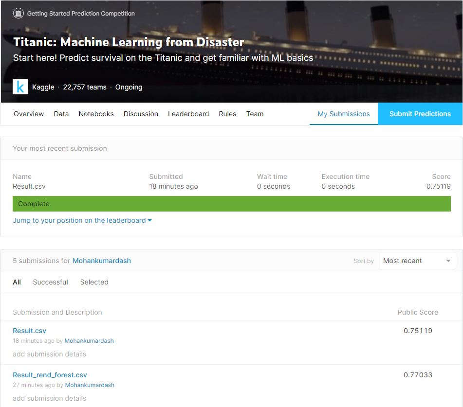

# Problem Statement
This problem belongs to Titanic ML competition hosted in Kaggle platform.

The competition is simple: use machine learning to create a model that predicts which passengers survived the Titanic shipwreck.

The sinking of the Titanic is one of the most infamous shipwrecks in history.

On April 15, 1912, during her maiden voyage, the widely considered “unsinkable” RMS Titanic sank after colliding with an iceberg. Unfortunately, there weren’t enough lifeboats for everyone onboard, resulting in the death of 1502 out of 2224 passengers and crew.

While there was some element of luck involved in surviving, it seems some groups of people were more likely to survive than others.

In this challenge, goal is to build a predictive model that answers the question: “what sorts of people were more likely to survive?” using passenger data (ie name, age, gender, socio-economic class

Road Map
1. Importing the dataset
2. Dropping out irrelevaent feature colums 'Name','PassengerId','Ticket'
3. Taking care of missing data
4. OneHot encoding of categorical features
5. Visualizing with Seaborn
6. Splitting inti Training and Validation sets
7. Chosing best parameters with GridSearchCv for Random_forest
8. Traing the Random_forest model with best_parameters obtained
9. Evaluating performance on Validation sets
10. Saving the model in a pickle file
11. Testing the model on Unseen Test data and uploading the results

